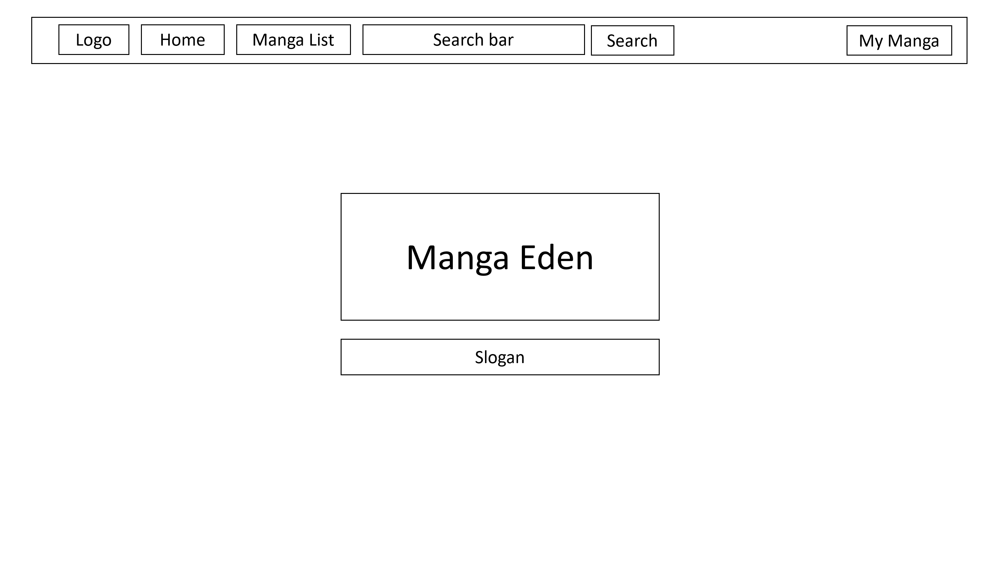
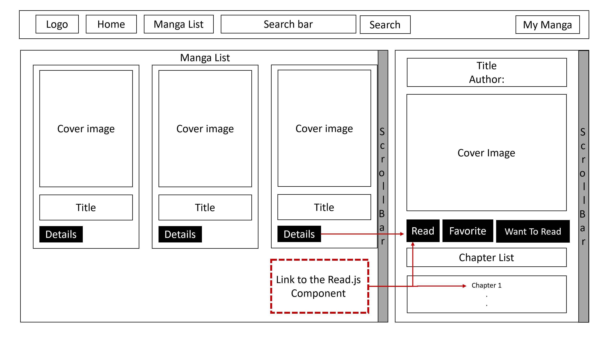
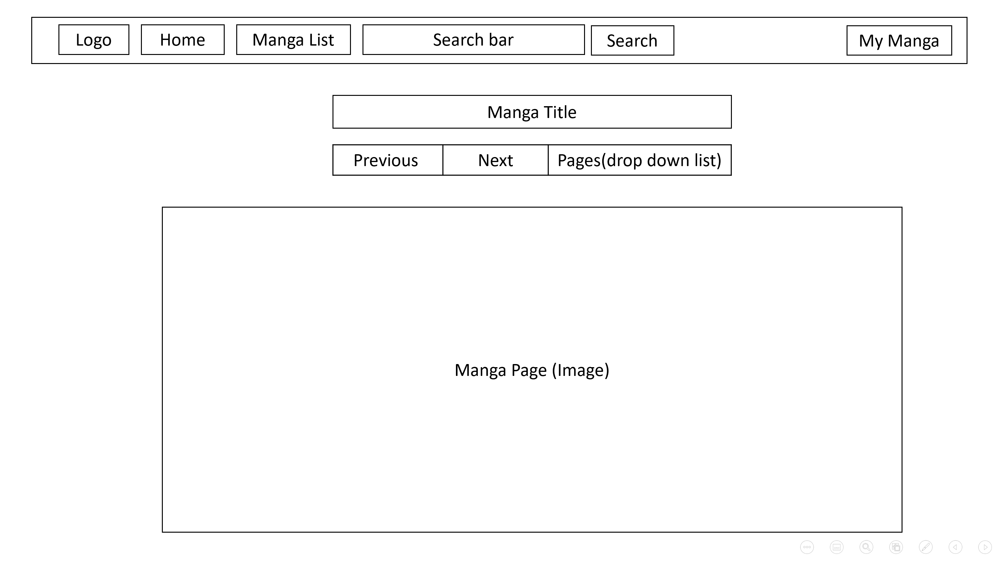
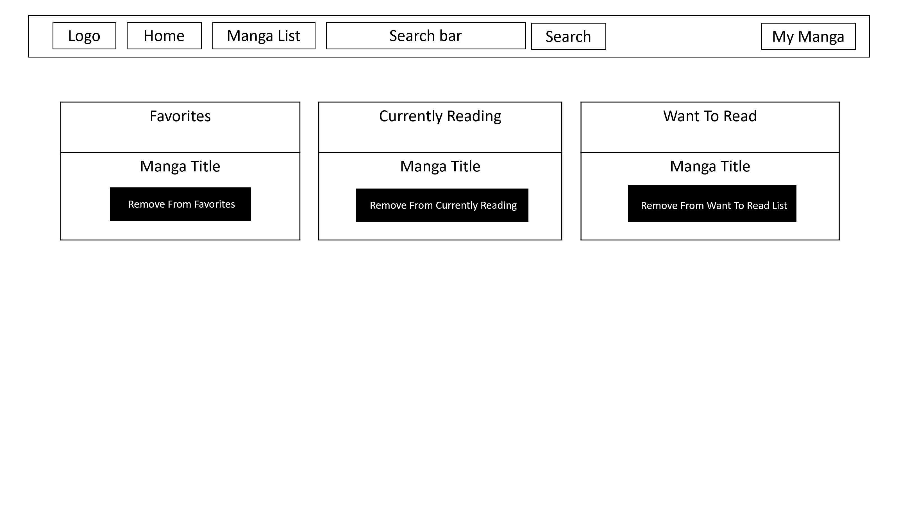

# Manga Eden
## Description

Manga Eden is website that provides online access to a variety of mangas. Users can view all mangas available, read them, and display a list of their favorite mangas along with what they're currently reading and a list of mangas they want to read in the future.

### Technical Used

```

- React
- Bootstrap
- Ajax (axios) for API
- React Router
```

### Wireframes







### User Stories

```
-	User Can access all pages on the website using the navbar (except for the reading page which can only be accessed through the manga list page). The navbar exists on all pages.
-	User can find any manga they want (if it’s available on the website) through the search bar within the nav bar. The search bar will automatically redirect them to the manga list page where it will display the search results.
-	By clicking on the mangaList link on the navbar user is redirect to that page where the cover and title of all available mangas will be displayed with an option to view manga details. 
-	The details section located on the right-hand side of the page will be empty to begin with. After a user clicks on a manga to display its details, the details section will show manga title, author, cover page and a list of all chapters, long with three buttons that allow the user to add the selected manga to the list of their favorite mangas, add the manga to their want to read list, or read the manga.
-	Clicking on the “Read” button will redirect the user to the reading page where the first page of the most-recent chapter will be automatically displayed.
-	A user can pick a chapter to read by clicking on it’s link from the list of chapters within the details section.
-	To view all mangas added to a user’s list, the user can click on the “MyManga” link available in the navbar where three lists are displayed: favorites, currently reading and want to read. A button follows the title of each manga which allows the user to remove that manga from their list.
```

---

## Planning and Development Process

-	Find an API and view the data it provides.
-	Draw the wireframes and how the user will navigate through the pages.
-	Build the MVP.
-	Add additional options to make navigation through the website easier.
-	Style and layout.
-	Test and edit.


### Problem-Solving Strategy

good old console.log+inspect to find the soucre of any problem.

### Unsolved problems

-Non (that I'm aware of).

### Edits for future versions
- make the page responsive.
- Add additional styling.
- connect the website to a backend that would make storing users’ info possible. 
- display more mangas(for now, only a filtered list of 100 mangas is displayed but the API provides more than 6000 mangas).


## APIs Used

All manga information was retrieved from the 
[Manga Eden API](https://www.mangaeden.com/api/).
Different calls were made to the API in different components to get the required information. 
- URL: https://www.mangaeden.com/api/list/[language]/: was used to get information about all available manga provided by the API
- URL: https://www.mangaeden.com/api/manga/[manga.id]/: was used to get manga details and the chapter list
- URL: https://www.mangaeden.com/api/chapter/[chapter.id]/: was used to get a list of chapter pages.

---

## Acknowledgments

Thanks to GA's instructors team for always being available whenever help was needed. Also, special thanks to this random guy on [stackoverflow](https://stackoverflow.com/questions/52377765/unable-to-get-image-url-in-mangaeden-api-angular-6 ), whose answer fixed the problem I had with images display. I don't think I would've been able to carry on with this project without it.
---

